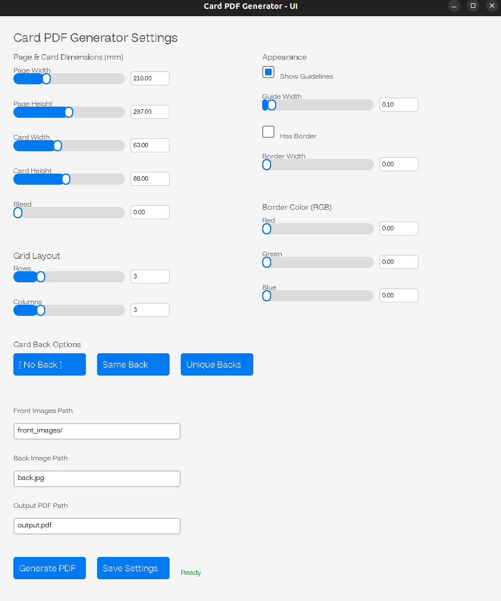
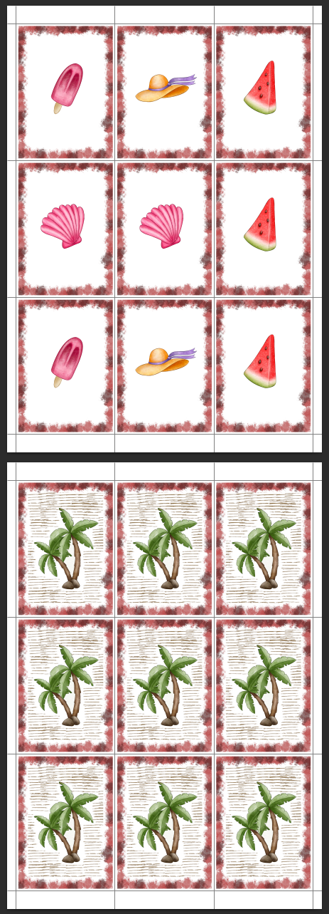

# Card PDF Generator

## About the Project

This is a tool written in C++ designed to create print-ready PDF files from a collection of card images. It arranges the images in a grid on one or more pages, with support for front and back sides, customizable borders, bleed areas, and cutting guide lines.

This is ideal for preparing custom trading cards, board game cards, or any other type of card for printing.

|       App screenshot:        |    Example generated PDF     |
|:----------------------------:|:----------------------------:|
|  |  |

## Usage

The core of the application is the `CardPDFGenerator` class. Here's an overview of its functionalities:

1.  **Initialize the Generator**: Create an instance of `CardPDFGenerator` by passing a `Settings` struct. The settings allow you to customize:
    *   Page dimensions (`pageWidth`, `pageHeight`)
    *   Card layout (`rows`, `columns`)
    *   Card dimensions (`cardWidth`, `cardHeight`)
    *   Printing guides (`bleed`, `borderWidth`, `showGuideLines`)
    *   Border appearance (`hasBorder`, `borderColor`)
    *   Back side printing mode (`backMode`)

2.  **Generate the PDF**: Call the `generatePDF` method with the following parameters:
    *   `outputPath`: The path where the final PDF will be saved.
    *   `frontImagesPath`: A path to a directory containing the front-side images of the cards.
    *   `backImagesPath`: A path to a directory or a single file for the back-side images, depending on the chosen `backMode`.

### Key Functionalities

*   **PDF Creation**: Generates a multi-page PDF document from image files (`.png`, `.jpg`, `.jpeg`).
*   **Grid Layout**: Automatically arranges cards into a grid based on the specified number of rows and columns.
*   **Back Side Support**: Offers three modes for card backs:
    *   `NoBack`: No back pages are generated.
    *   `SameBack`: A single image is used for the back of all cards.
    *   `UniqueBacks`: Each card has a corresponding unique back image from a specified directory.
*   **Customizable Printing Marks**:
    *   **Bleed Area**: Adds extra space around each card to ensure the design extends to the edge after cutting.
    *   **Borders**: Draws a border around each card with a customizable color and width.
    *   **Guide Lines**: Adds faint lines to the PDF to indicate where to cut the cards.
*   **Settings Validation**: Before generating the PDF, the system validates that the cards, with the specified dimensions and spacing, will fit on the page.

## Contact

If you have any questions, suggestions, or feedback, please don't hesitate to reach out:
- GitHub: [@MihaiAnca13](https://github.com/MihaiAnca13)
- Email: [Mihai Anca](mailto:41regdzqx@mozmail.com)

